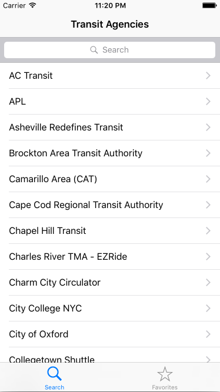
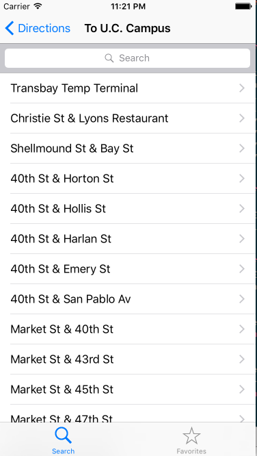
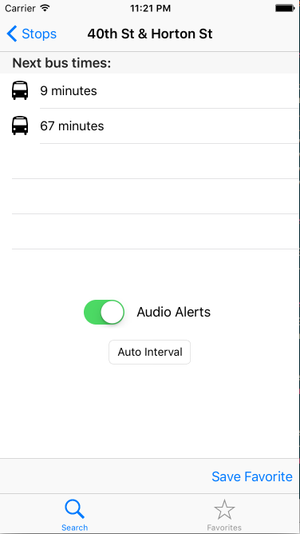
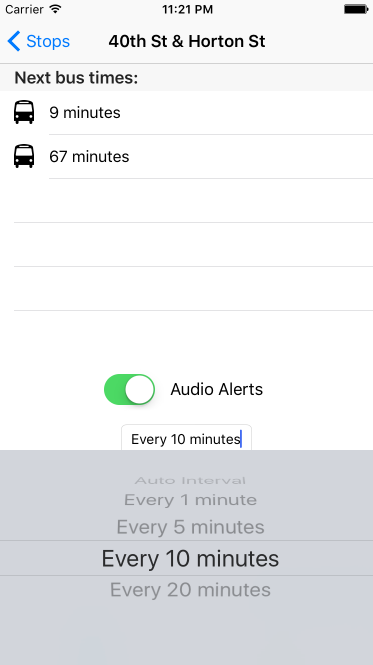

# Busy Buses

## Purpose
Busy Buses gives users periodic audio readouts as a bus is approaching their  
stop, allowing them to time their transit perfectly without constantly checking  
prediction times.

## Features
* Ability to select a bus agency, bus line, direction, and stop from the 
NextBus / RestBus API
* Ability to search and filter through selections
* Automatic time prediction updates
* Ability to enable/disable "audio readout" mode
* Ability to read out time predictions at periodic intervals (1 to 20 min.)
* Time interval can be user-configurable or automatically increasing in  
frequency as the bus draws closer
* Ability to save a stop as a "Favorite" and view favorites

## Control Flow
* Users are presented with a series of lists to select their target bus agency,  
line, direction, and stop name
* User sees upcoming bus times for their selected stop
* User can push a button to enable "audio readouts" which would begin text  
to speech readouts of time predictions
* User listens to these predictions and catches their bus on time
* User stops the audio readouts or closes the app

## Implementation

### Model
* SwiftyJSON.swift (3rd-party library)

### View
* StopView.swift
* Main.storyboard views

### Controller
* AgencyController.swift
* BusLineController.swift
* DirectionController.swift
* StopController.swift
* FavoritesViewController.swift

## Screenshots

  

  
